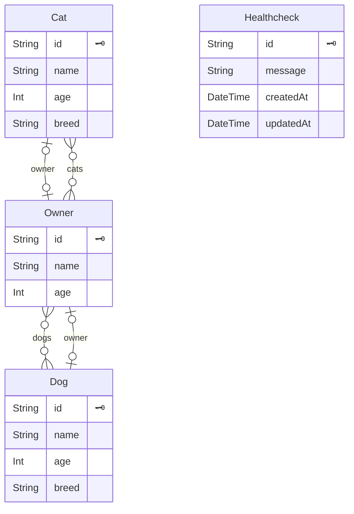

```mermaid
erDiagram

  "Cat" {
    String id "🗝️"
    String name 
    Int age 
    String breed 
    }
  

  "Dog" {
    String id "🗝️"
    String name 
    Int age 
    String breed 
    }
  

  "Healthcheck" {
    String id "🗝️"
    String message 
    DateTime createdAt 
    DateTime updatedAt 
    }
  

  "Owner" {
    String id "🗝️"
    String name 
    Int age 
    }
  
    "Cat" o|--|o "Owner" : "owner"
    "Dog" o|--|o "Owner" : "owner"
    "Owner" o{--}o "Cat" : "cats"
    "Owner" o{--}o "Dog" : "dogs"
```
